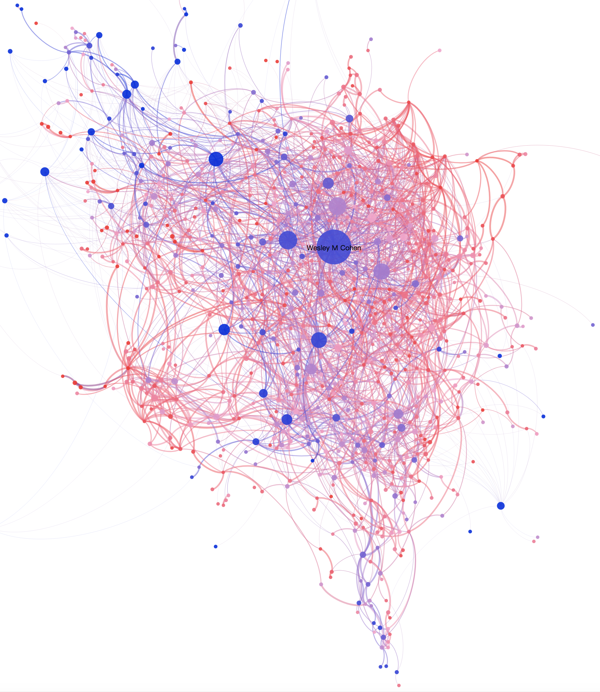
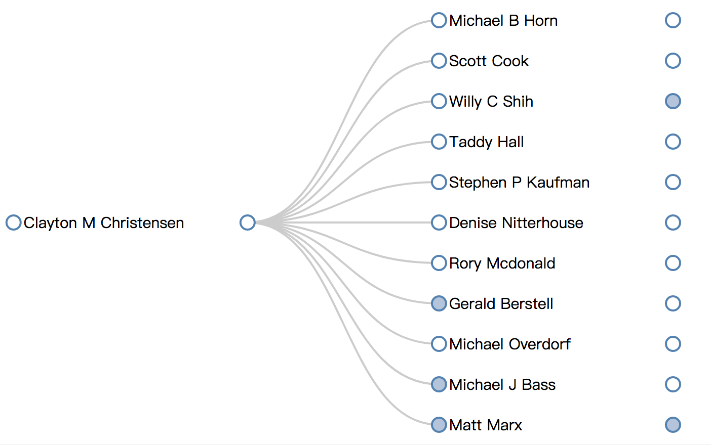
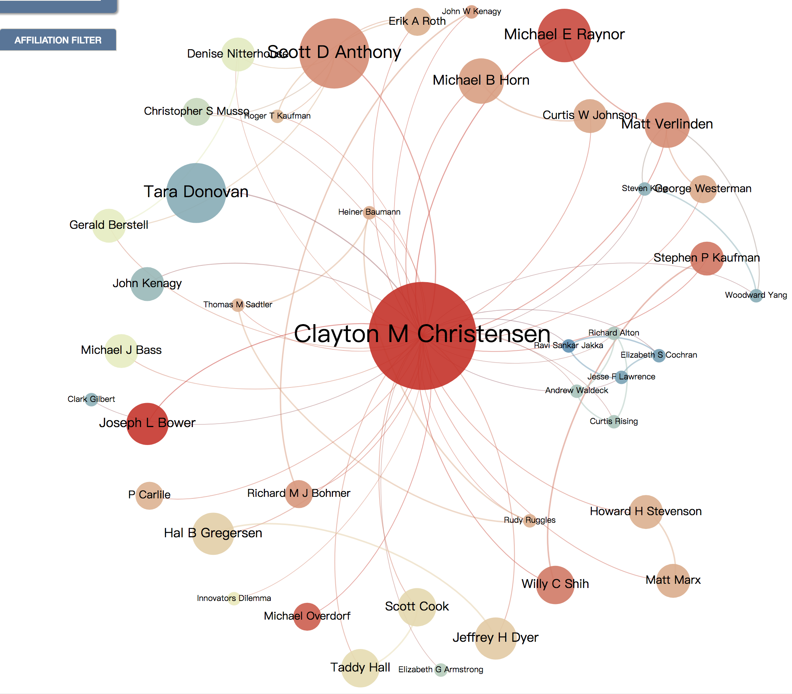

# 作者列表

## 约瑟夫·熊彼特
约瑟夫·熊彼特（Joseph Alois Schumpeter，1883年<癸未年>2月8日—1950年1月8日。
代表作有《经济发展理论》《资本主义、社会主义与民主》《经济分析史》等，其中《经济发展理论》是他的成名作.

## 迈克尔·波特 
迈克尔·波特（Michael E.Porter，1947—）他是哈佛商学院的大学教授（大学教授 University Professor，是哈佛大学的最高荣誉，迈克尔·波特是该校历史上第四位获得此项殊荣的教授）。迈克尔·波特在世界管理思想界可谓是"活着的传奇"，他是当今全球第一战略权威，是商业管理界公认的"竞争战略之父"，在2005年世界管理思想家50强排行榜上，他位居第一。迈克尔·波特不仅在学术界和商业界获奖无数，还获得过公民勋章，这一褒奖通常授予战斗英雄或者是异常杰出的运动员。波特曾多年活跃于美军后备队，年轻时是高校里颇负盛名的橄榄球、棒球及高尔夫球队员。

提出竞争的五力模型：包括同行业竞争者，供应商的议价能力，购买者的议价能力，潜在进入者威胁，替代品威胁。

代表作《竞争战略》《竞争优势》《国家竞争优势》

## 理查德·N·福斯特
理查德·N·福斯特(Richard N. Foster)。在麦肯锡任职32年，在麦肯锡开创了包括私募股权、医疗卫生、科技和创新咨询在内的多个咨询服务部门。知名经济学家熊彼特“创造性破坏”理论的集大成者，颠覆创新理论之父克莱顿·克里斯坦森（Clayton Christensen）在麦肯锡期间曾经在他的指导下做研究。

代表作《创造性破坏》、《创新：进攻者的优势》

## 克莱顿·克里斯坦森
克莱顿·克里斯坦森（Clayton M. Christensen)，出生于美国盐湖城，1975年在杨百翰大学以优异表现获得经济学荣誉学士，1979年在哈佛商学院以优异成绩获得MBA学位，1992年重返哈佛商学院获得DBA学位之后并任哈佛商学院教授，任职于哈佛商学院总经理及技术与运营管理部1995年度麦肯锡奖得主。克里斯滕森是"颠覆性技术"这一理念的首创者。

## 亨利·明茨伯格
亨当今世界上最杰出的管理思想家之一。 加拿大麦吉尔大学（McGill）管理学院教授，战略管理学会主席，在欧洲工商管理学院、伦敦商学院、埃克斯-马赛大学、卡内基•梅隆大学和蒙特利尔高等商学院等学校担任访问学者。他曾两次获得《哈佛商业评论》所颁发的年度最佳文章“麦肯锡奖”。他最知名的著作《管理工作的本质》奠定了其管理大师地位。他对管理工作的观察与研究，至今无人能超越。
代表作《管理工作的本质》《战略历程》

## 查尔斯·汉迪
查尔斯·汉迪（Charles Handy），1932年出生于爱尔兰，是欧洲伟大的管理思想大师。英国《金融时报》称他是欧洲屈指可数的“管理哲学家”，并把他评为仅次于彼得·德鲁克的管理大师。如果说彼得·德鲁克是“现代管理学之父”，那么查尔斯·汉迪就是当之无愧的“管理哲学之父”。
1967年，查尔斯·汉迪返回英国创办了英国首家管理研究生院——伦敦商学院，并成为该学院的全职教授。他以“组织与个人的关系”“未来工作形态”的新观念而闻名于世，成为继彼得·德鲁克之后在世界上拥有读者最多的管理学权威。

曾著有《组织的概念》《空雨衣》《非理性的时代》《拥抱不确定性》等。

## 吉姆·柯林斯
吉姆·柯林斯（1955—），英文名：Jim Collins，男，毕业于斯坦福大学。著名的管理专家及畅销书作家，影响中国管理十五人之一。曾获斯坦福大学商学院杰出教学奖，先后任职于麦肯锡公司和惠普公司。与杰里·I·波勒斯合著了《基业长青》,《重塑战略》

## 罗伯特·卡普兰
是平衡记分卡（Balanced Scorecard，简称BSC）的创始人，美国平衡记分卡协会主席。
现执教于哈佛商学院领导力开发专业之Marvin Bower教席；担任哈佛教职长达18年，之前他曾执教于卡耐基-梅隆大学管理学研究生院（GSIA）达16年之久。
代表作《战略地图》《平衡计分卡》
 
## 理查德·鲁梅尔特
加州大学洛杉矶分校管理学院的教授。麦肯锡把他称为是“战略中的战略家”。他还被《经济学人》评为“当今25位对管理理念和公司行为最具世界影响力的思想家之一”。
代表作《好战略，坏战略》

## 创新人物关系图谱
[Innovation - Acemap](https://www.acemap.info/paper-map?topicID=0130638A)
韦斯利.科恩

## 克莱顿·克里斯坦森的关系图谱
[Clayton M Christensen - Acemap](https://www.acemap.info/co-author-map?authorID=7D93B5D0)

## changelog
20190620 chris 补充作者列表
20190616 chris newadd

